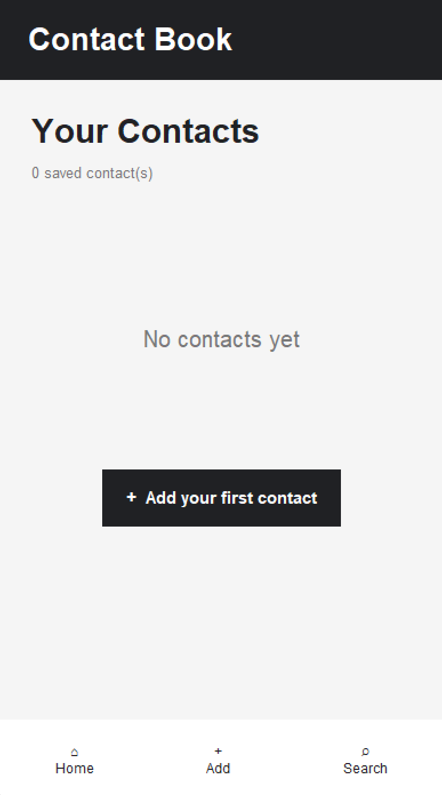

# 📱 Contact Book

> A simple contact manager built with Python and a mobile-style graphical interface.

## ✦ About

**Contact Book** is a beginner-friendly Python project that lets users save and manage their contacts through a simple GUI.

You can add contacts, view saved contacts, search for them, edit their details, and delete them.

## 🖥️ Preview

  

## ✨ Features

- ➕ Add new contacts
- 👀 View saved contacts
- 🔍 Search contacts
- ✏️ Edit contact details
- 🗑️ Delete contacts
- 📱 Mobile-style interface
- 🐍 Built completely with Python

## 🛠️ Built With

- Python
- Tkinter

No external libraries are required.

## 📚 What I'm Learning

This project helped me practice:

- **Dictionaries** — storing contact information
- **Lists** — working with collections of data
- **Functions** — organizing code into smaller parts
- **Classes & Objects** — understanding basic OOP
- **`if / elif / else`** — controlling program flow
- **Loops** — working with collections of contacts
- **User Input** — taking and processing information
- **GUI Development** — creating interfaces with Tkinter
- **Event Handling** — connecting buttons to actions
- **Data Management** — adding, updating, searching and deleting data

## ▶️ How to Run

Make sure Python is installed.

Run the program with:

    python contact_book.py

## 🌱 Project Goal

The goal of this project was to move beyond basic Python exercises and build a small application where multiple Python concepts work together.

---

`learn → build → improve`

